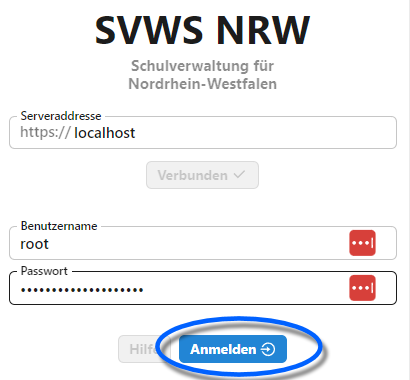
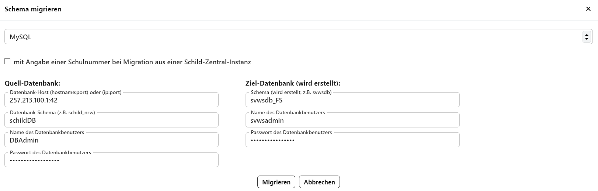

# Admin Client

## Login und Übersicht
Rufen Sie den _[Server]/admin_ auf, um den **Admin Client** zu starten.

Bei einer lokalen Installation wäre _localhost/admin_.

*Loggen Sie sich mit dem root-Nutzer Ihrer MariaDB und dem root-Paswort ein. Klicken Sie auf **Anmelden***.

Oben links zeigt **Ro** an, dass der Rootuser angemeldet wurde.

Melden Sie sich unten links mit einem Klick auf **Abmelden** ab.

Wie im Client gewohnt, lässt sich hier auch die **Ansicht** ändern.

## Schemamanagement ANPASSEN TODO!!!

Unter **Schema** lassen sich die auf dieser MariaDB laufenden Schemas auswählen.

Zu jedem Schema werden dann rechts der **Name** und die **Daten der Schule** oben rechts angezeigt. Ganz unten werden die **Admin-Benutzer** der jeweiligen Datenbank mit ihrem Namen und Benutzernamen aufgeführt. 

Im mittleren Bereich lässt sich ein bisheriges SchILD-NRW-2-Schema in dieses Schema migrieren. Dieser Vorgang überschreibt die im Schema aktuell vorliegenden Daten.

Weiterhin lässt sich das aktuelle Schema als **Backup erstellen**. Hierbei wird in eine .sqlite-Datei migirert, welche im Anschluss gespeichert wird und über **Backup wiederherstellen** neu eingelesen werden kann.

### Weitere Information zu einem Schema

In der Schema-Übersicht links finden sich Angaben zur **Revision**, **Tainted** und **Config**.

* Die **Revision** kennzeichnet den technischen Aufbau der Datenbank. Diese kann relevant sein, wenn externe Programme direkt auf die Datenbank zugreifen und diese Programme relativ zum Datenbankschema veralten. Über die Revision kann auf Kompatibilität geprüft werden, um Fehler zu vermeiden.
* Ein Schema, das für die Entwicklung und zum Testen neuer Features gedacht ist, kann als  **Tainted** oder **Verschmutzt** markiert werden, damit dieses mit ihren Datenbanken nicht im echten Produktivbedtrieb zum Einsatz kommt.
* Weiterhin ist es möglich, dass sich auf der MariaDB Schemas befinden, die aber nicht zum SVWS-Server gehören. Dieser werden dann als nicht zur **Config** des SVWS-Servers zu gehören und werden von diesem bezüglich des Servers und Clients ignoriert. Ein Beispiel könnte etwa ein Stundenplanprogramm eines anderen Herstellers oder die Datenbank der kommunalen Führerscheinstelle sein.

## Operationen für ein neues Schema

Über die **Checkboxen ☑** lassen sich eines oder mehrere Schemas anwählen und über einen dann darunter auftauchenden **Mülleimer 🗑** löschen.

Es lässt sich über **TODO ICON** eine SchILD-2-Datenbank in ein neues Schema migireren. Hierbei besteht die Auswahl aus den Quellen MS Access, MySQL, MariaDB, MSSQL und es sind die Daten einzugeben, um die Quelldatenbanken zu erreichen und das intendierte Ziel, das nun neu angelegt wird.

Hier im Beispiel wird eine "schildDB" einer fiktiven IP-Adresse abgerufen, um diese in die svwsdb einer Förderschule einzuspielen.

Bei einer Migration aus SchILDzentral ist eine Schulnummer zu übergeben.

Über den drehenden Pfeil **↻** lässt sich ein gespeichertes sqlite-Image in ein *neues* Schema einspielen.

Mittels **Kopieren 🗐** wird ein existierendes Schema dupliziert. 

Das **+** legt ein neues, leeres Schema an, in das im Anschluss migriert, Backup eingespielt und so weiter werden kann.