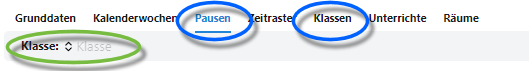
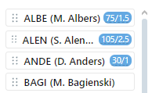

# Stundenpläne erstellen und bearbeiten

Ein neuer Stundenplan kann einfach über *Drag & Drop* erstellt werden, ebenso lassen sich existierende, auch aus einem Stundenplanprogramm importierte, Stundenpläne verändern.

Lesen Sie bitte den Artikel der ````App Stundenplan```` für eine ausführlichere Erkläuterung der einzelnen Elemente eines Stundenplans.

Wird ein neuer Stundenplan erstellt, müssen zuerst die **Grunddaten**, **Kalenderwochen**, **Pausenzeiten**, **Zeitraster** und **Räume** entsprechend der Kriterien erstellt werden. Konsultieren Sie hierzu die Artikel der jeweiligen Themen und den Artikel zur *App Stundenplan*.

Weiterhin müssen **Unterrichte** für die Schülergruppen, Klassen oder Jahrgänge in der Oberstufe, vorhanden sein.



Sie können nun Pläne für die **Pausen**aufsichten und **Klassen** erstellen und bearbeiten.

Bearbeiten Sie eine Klasse, wählen Sie die betreffende ````Klasse````, hier im Screenshot grün dargestellt.

**Hinweis:** Der Stundenplan im Beispiel arbeitet exemplarisch mit A- und B-Wochen.

## Pausen bearbeiten und Erklärung des Interfaces


Auf der linken Seite sind alle Lehrkräfte zu sehen, die per ````Drag & Drop````in den *Kacheln* rechts in die *Zeitplätze* gezogen werden können.

Bei einer Aufsicht kann eine Lehrkraft zum Beispiel im Bereich **AUS**gang in *Alle* für beide Wochentypen oder nur in die *A-* oder *B-Woche* gezogen werden.

Ebenso ist zu sehen, dass Montag in der Aufsicht AUS jeweils zwei Lehrkräfte hinein gezogen wurden. Mehrfachbelegungen sind somit möglich.


Hier im Beispiel werden die Lehrkräfte *ALBE* und *BALD* Montags in der Aufsicht AUS in die A- und die B-Woche gezogen.

Um eine Aufsicht zu entfernen, ziehen wir sie aus dem Plan einfach nach links in die Auswahlliste zurück.


Der rot gestrichelte Rand um die Auswahliste zeigt beim Entfernen an, dass eine Lehrkraft aus der Aufsicht ausgetragen wird.

Da nun die A- und B-Wochen mit anderen Lehrkräften belegt sind, wird *LAN1* aus dem Bereich *Alle*, der für beide Wochentypen gilt, entfernt.


In der endgültigen Planung ist nun zu sehen, dass Montag in der Pause 10:25 - 10:55 im Bereich AUS die Lehrkraft Mey in beiden *(Alle)* Wochen eingesetzt ist, und ALBE und BALD jeweils in der A- und B-Woche.

In der Übersichtsliste werden auch die Einsätze der Lehrkräfte gezeigt.



In der Übersichtsliste sind nun auch die Summen der Aufsichtseinsätze zu sehen. Hierbei zeigt das Feld **Minute/Zahl der Aufsichten** an.

Im Beispiel von ALBE ist zu sehen, dass diese Lehrkraft 75 Minuten in 1.5 Aufsichten eingesetzt ist. Diese Lehrkraft hat hier eine Stundenaufsicht mit *60 Minuten* und einer Wertigkeit von *1* sowie eine halbe Stunde alle zwei Wochen, daher werden *15 Minuten* und eine *0,5*-Aufsicht angerechnet. 

## Stundenpläne bearbeiten

