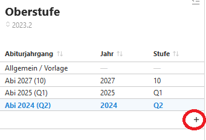
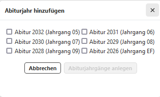
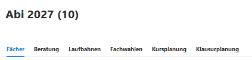

# Einrichtung der Jahrgänge
Durch "+" können die aktiven Jahrgangsstufen der Oberstufe sowie eine ggf. neu zu planende EF hinzugefügt werden.  

 

  

Es können nun die **allgemeine Vorlagen** oder individuell **die jeweilige Jahrgangsstufe** bearbeitet werden hinsichtlich:
1. Fächereigenschaften
2. Ausschlussregeln
3. Weitere Kombinationsbedingungen
4. Beratungslehrkräfte
5. ...

Nach Anklicken eines angelegten Jahrganges erweitert sich die Auwahl im rechten Fenster des Jahrganges:

 