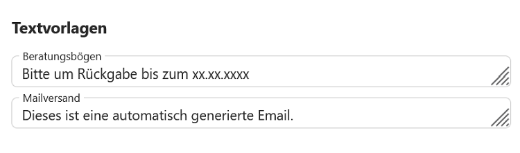

# Beratung

## Vorlage Beratungsbogen
Es kann unter Auswahl von **Allgemein/Vorlage** im Beratungsbogen eine Standardvorlage erstellt werden.  
Im Beispiel sind M und Sp belegt, da diese Fächer - ebenso wie D - eine Pflichtbelegung darstellen.
Der Einsatz solcher Vorlagen ist optional.

 

## Übernahme in Abschnitt
Nach Auswahl einer der angelegten Abiturjahrgänge kann für diesen die **Vorlage geladen** werden.  
Ebenso kann diese Vorlage jetzt noch einmal **individuell für die ausgewählte Jahrgangsstufe angepasst** werden.  
Diese Vorlage wird beim späteren Export der Schülerdateien (\*.lp-Dateien, früher LuPO-Schülerdatei) übernommen.  

 

## Beratungslehrer
Im Feld rechts neben der Beratungsbogenvorlage können **Beratungslehrer der Stufe** hinterlegt werden.  

 

Ganz unten können für den Ausdruck der Beratungsbögen oder einen Email-Versand **Textverlagen** eingetragen werden.

 

