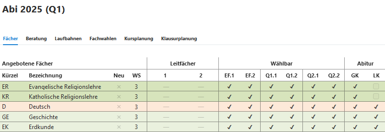
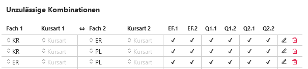
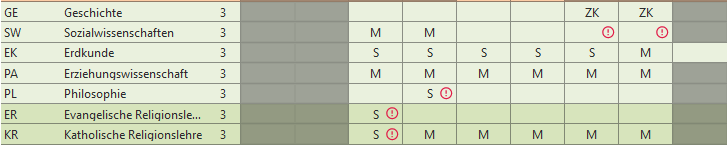

## Angebotene Fächer

Hier wird (als Vorlage oder auch individuell für jeden Jahrgang) festgelegt, in welchem Abschnitt ein Fach und ob es als Abiturfach (GK oder LK) angeboten wird.

 

## Unzulässige Kombinationen
Hier können an Ihrer Schule unzulässige Kombinationen festgeelgt werden. 
Zu beachten ist: 
**Nur das zweitgenannte Fach wird im Beratungsbogen als unzulässig markiert**. 
Damit beide sich ausschließende Fächer im Beratungsbogen angezeigt werden, muss die Kombnation auch andersherumeingetragen werden (s. unten stehendens Beispiel). 

 

## Geforderte Kombinationen 
Bedingt die Wahl eines bestimmten Faches die Wahl eines anderen Faches, so kann die Bedingung in der logischen Reihenfolge hier eingetragen werden. 
Die Gründe für solche Bedingungen können eine möglichen Profilbildung aber auch organisatorisch sein. 

 

## Beispiele

*ER schließt KR aus* UND *KR schließt ER aus*. Daher erhalten im Beratungsbogen beide Fächer einen Warnhinweis. 

*KR schließt PL aus* aber nicht umgekehrt. Daher erhält im Beratungsbogen bei Wahl von *KR* nur *PL* den Warnhinweis, wenn es zusätzlich zu *KR* gewählt wird.

*GE-ZK fordert SW-GK*. Daher erhält *SW* bei Wahl von *GE-ZK* einen Warnhinweis.

Anmerkung: Derzeit beteht keine Möglichkeit von **oder**-Forderungen, also z.B.*GE-ZK fordert SW-LK* **oder** *SW-GK*

 