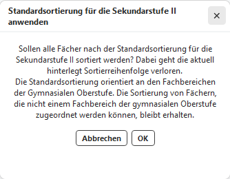

# Fächer der Oberstufe

## Ansicht
Hier werden die Fächer mit ihren in SchildNRW hinterlegten Eigenschaften angezeigt. Diese können hier auch berarbeitet werden. 

## Reihenfolge
Die Reihenfolge der Fächer kann bzgl. der in SchiLD hinterlegten '''Reihenfolge für die Sek II''' übernommen werden.  
Das ist insbesondere für eine sinnvolle '''Reihenfolge in den Beratungsbögen''' der Laufbahnplanung wichtig.

  

  