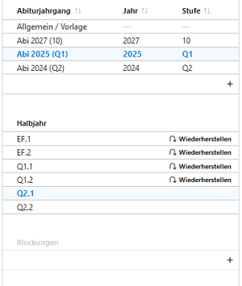

# Kursplanung 

## Blockungsübersicht

Zu jedem Abiturjahrgang kann in jedem Abschnitt eine oder mehrere Blockungen angelegt oder aus bestehenden Daten wieder hergestellt (restauriert) werden.
Wiederherstellung erfolgt dann, wenn die vorliegende Datenbank bereits importierte Blockungen enthält.

### Fall Wiederherstellung und Weiterbearbeitung
Wiederherstellung ist nur möglich, wenn in der Datenbank bereits Blockungsdaten vorliegen, z.B. nach einer Migration einer Schild2-Datenbank oder vergleichbarer Datenbestände.  
 
Nach Auswahl von Abiturjahrgang und Abschnitt **Wiederherstellen** aktivieren. Die Blockung wird dann als **Restaurierte** Blockung angezeigt. 
Angezeigt wird eine Übersicht über eingerichtete Kurse, in welchen Schienen sie liegen usw.

### Fall Neue Kursblockung

Über das **+**-Symbol wird eine neue Blockung erstellt.  
Es sollten dazu vollständige Fachwahlen für den gewählten Abschnitt vorliegen.  
Zum Ablauf der Einrichtung/Erstellung einer **neuen Blockung** siehe [Erstellen einer neuen Blockung](/gost/kursplanung/index.md#erstellen-einer-neuen-blockung)

## Übersichten, Filter, Belegungsmatrix  

  

Die Blockungsübersicht zeigt die Lage der Kurse in den Schienen an, ebenso die Belegungszahl einer Schiene, die jeweilige Kursgröße.  
Im Falle einer **neu angelegten Blockung liegt noch keine Verteilung** vor.  
Hinweis: sollte eine Kursgröße in diesem Format angegeben sein: 14|3, so befinden sich in diesem Kurs 14 Schüler der eigenen Schule und 3 einer Koopschule (Status Extern)  
**Weitere Funktionen** in dieser Übersicht werden unten stehend erläutert.  

### Schülerlisten (nach Filter)   

Rechts neben der Kursübersicht befinden sich **Schülerlisten**, deren Inhalt **gefiltert** werden kann:
- **kein Filter**
- **Fachfilter**: Schüler mit einem bestimmten gewählten Fach und Kursart filtern. Beispiel: Alle mit **Fachwahl Deutsch LK**
- **Kursfilter**: Schüler eines gewählten Kurses filtern. Beispiel: Alle, die dem **Kurs D-LK1** zugewiesen sind.

Weiterhin kann auf diese Eigenschaften gefiltert werden:
- **K** **K**ollision: Schüler, die in der aktuellen Blockung eine Kurskollision haben, also zwei Kurse in einer Schiene.
- **NV** **N**icht **V**erteilt: Schüler, für die mindestens eine Fachwahl keinem Kurs zugewiesen ist.
- **K/NV**: Schüler mit Kollision und einer nicht verteilten Fachwahl. 

Die **Symbole** hinter den Namen stehen für das **Geschlecht** und die Eigenschaft **mündlich** oder **schriftlich** belegt.

## Blockung berechnen
Um eine Blockung berechnen zu lassen, müssen zuvor
- Kurse eingerichtet werden  

und können zusätzlich  
- Fixierungen und Sperrungen von Kursen für bestimmte Schienen festgelegt werden  
- mögliche Schülerfixierungen in Kurse gesetzt werden  
- weitere Regeln (s.u.) gesetzt werden

Siehe dazu hier: [Erstellen einer neuen Blockung](/gost/kursplanung/index.md#erstellen-einer-neuen-blockung)  

### Berechnungen durchführen

  

Es kann gewählt werden, ob die Berechnungen von eigenen Client-PC (ausführlich) oder dem Server (schnell) berechnet werden sollen.  
Unter **Ausführlich** können unter den ausgegebenen Ergebnissen bestimmte ausgewählt werden. 
Unter **Schnell** können zu schlechte Ergebnisse unmittelbar gelöscht werden.

### Bewertungskriterien 

In beiden Berechnungsszenarien werden die Ergebnisse mit vier Bewertungskriterien angegeben.  Durch Bewegung des Mauszeigers auf die Werte werden weitere Erklärungen dazu sichtbar (Fly-Over-Menü bzw. Tool-Tips).  
- Regelverletzungen (sollten 0 sein)
- Fachwahlkonflikte (sollten 0 sein)
- Kursdifferenzen (hängt von individuellen Bedingungen ab)
- Häufigkeit der Kursdifferenzen größer 0 (im Fly-Over-Tool-Tip werden die betroffenen Kurse angezeigt.)  

### Ableiten einer Blockung
Um ein vorliegendes Ergebnis einer Berechnung oder den Grundzustand der Blockungseinrichtung bestehen zu lassen und immer wieder darauf zurückgreifen zu können, kann durch **"Ableiten"** die Blockung dupliziert werden. Es können dann neue Regeln ergänzt oder bestehende gelöscht werden, um dann wieder neu zu berechnen.

## Blockung aktivieren

Ist die Blockung fertig, kann sie durch **Blockung aktivieren** in die Datenbestände (Kurse, SchülerLeistungsdaten, ...) übernommen werden.

## Erstellen einer neuen Blockung

### Grundeinstellungen der Blockung

  

**1**: **Hinzufügen** weiterer **Schienen**. Nicht benötigte Schienen können mit dem Papierkorb hinter der Schienennummer **gelöscht** werden.  

**2**: Untermenü für einen eingerichteten Kurs
+ **Papierkorb**: Löschen des Kurses
+ **Hinzufügen**: Kurs des Faches und der Kursart wird hinzugefügt
+ **Aufteilen**: Zunächst wie Hinzufügen. Befinden sich Schüler in dem Kurs, so wird ein weiterer Kurs mit identischem Fach und Kursart hinzugefügt und die Schüler des gewählten Kurses hälftig in beide Kurse verteilt.
+ **Zusammenlegen**: Es kann ein Kurs mit identischem Fach und Kursart gewählt werden, dessen Schüler werden dann in den ausgewählten Kurs übernommen, der dann leere Kurs wird unmittelbar gelöscht.
+ **Externe Schüler**: Durch **+** kann bereits die Zahl der zu erwartenden externen Schüler ergänzt werden. Dieser Wert wird dann bei den Kursdifferenzen berücksichtigt.
+ **Zusatzkräfte**  können ggf. eingetragen werden.
+ **Schienen**: Der Kurs kann auf weitere Schienen verteilt werden (z.B. bei "Huckepackkursen" oder besonderen Stundenplankonstellationen).  

**3**: Der Kurs kann per "Drag & Drop" in eine andere Schiene **verschoben** werden. Mit der Pinnnadel kann der Kurs in der Schiene **fixiert** werden (Nadel dann schwarz gefärbt).  

**4**: Der Kurs wird entgegen des Vorschlages doch **angelegt**.  

**5**: Durch Klicken in ein Feld wird diese Lage **für den einen Kurs gesperrt**.  

**6**: Die gesamte Schiene kann für **eine oder mehrere Kursarten gesperrt** werden.

**Hinweis:** Es ist häufig eine Frage des planerischen Geschickes (Übersicht, Reduktion von Rechenkapazität,...), ob Kurse eher in bestimmten Lagen fixiert, oder anders herum für bestimmte Lagen gesperrt werden.

### Regeln

*in Bearbeitung*

### Fixierungen

*in Bearbeitung*

Wurden alle Einstellungen gesetzt, kann die Blockung berechnet werden.  
Siehe [Berechnungen durchführen](/gost/kursplanung/index.md#berechnungen-durchführen)

### Beispiele und Praxistipps

Im folgenden Beispiel werden zunächst die Leistungskurse und anschließend die Grundkurse geblockt.  
 
Es sind einige erkennbare und nicht erkennbare Regeln und Fixierungen enthalten.:  

  

+ Einige **LKs** wurden in Schienen **fixiert** (schwarze Pinnnadeln).  
+ Die Schienen 3 bis 11 wurde für **Leistunskurse gesperrt** (graue Felder bei LKs).  
+ Die Schienen 1 und 2 wurden für **GKs und ZKs gesperrt** (graue Felder bei GKs, i.d.R. redundant durch LK-Setzung in Schienen 1 und 2). 
+ Die Kurse SP-LK1 und BI-LK2 sind **Koop-Kurse** (Unterricht an anderer Schule, Haken bei Koop gesetzt).  
+ Der Kurs BI-LK2 wurde auf **maximal zwei Schüler** begrenzt. Diese zwei Schüler belegen gleichzeitig M-LK1, daher sollen **nur diese beiden** in BI-LK2, aber niemand sonst, auch wenn das aus Blockungssicht möglich wäre.  
+ Die LKS D und E haben zunächst keine Vorgaben.

Einmaliges schnelles Blocken liefert evtl. noch Kollisionen, eine weitere Blockungsberechnung liefert in diesem Beispiel aber u.a. dieses Ergebnis:

 

Hier kann jetzt ein Ergebnis ausgewählt werden:

Ebenso können definitiv unbrauchbare Ergbnisse gelöscht werden. Wird der Haken direkt bei **ID** gesetzt, werden alle Ergebnisse markiert.  
Der Haken der Wunschergebnisses (und evtl. die Startvorlage) kann entfernt werden. Dann können alle anderen Ergbnisse auf einmal gelöscht werden.

**Hinweis:** Änderungen der Regeln sind nicht mehr möglich, solange mehrere Ergebnisse vorliegen. Es können jetzt nur Kurse-Schienen- oder Kurs-Schüler-Zuordnungen geändert werden.  
Zum **Ändern von Regeln** für neue Berechnungen darf entweder **nur ein Ergebnis stehen bleiben** oder die **Blockung muss abgeleitet werden**. Letzteres hat den Vorteil, dass auf die bisherigen Ergbnisse immer wieder zurückgegriffen werden kann.

#### Sport nur Nachmittags

#### Musik und Kunst parallel

 

