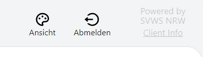

# SVWS Hilfe und Handbuch

<pre>Erstellungsdatum {{ datum(data.buildDate) }}</pre>

## Hilfe zum SVWS-Client 

Der **SVWS-Client** ist eine Web-Applikation zur Unterstützung der Verwaltungsprozesse an den Schulen Nordrhein-Westfalens.  

Der SVWS-Client schafft eine plattformübergreifende Benutzeroberfläche, die mit allen gängigen Browsern aufgerufen werden kann.

Dabei sollen nach und nach alle Aufgaben der bisherigen Schulverwaltungsprogramme aus NRW implementiert werden.

* Der SVWS-Client ersetzt bereits die Programme **LuPO** zur Laufbahnberatung in der gymnasialen Oberstufe und
* **Kurs42** zur Erstellung von Blockungen.
* Er die **Individual- und Leistungsdaten der Schülerinnen und Schüler** verwalten.
* Die **Verwaltung der Lehrkräfte** ist ebenfalls möglich.
* Zusätzlich zu den bisherigen Angeboten ist im SVWS-Client eine komfortable Anzeige von **Stundenplänen** hinzugekommen.

Das Gesamtprojekt _SVWS-Server_ ist ein Open-Source-Projekt des Landes Nordrhein-Westfalen.

## Bedienungshilfe

Der SVWS-Client wird über einen üblichen Internet Browser ausgeführt und arbeitet mit den großen Render-Engines für Browser zusammen.

**Zoom:**
Die Funktionen des Browsers werden somit direkt unterstützt, zum Beispiel können Sie das Fenster **zoomen**. Klicken Sie hierzu auf die Zoom-Schaltflächen Ihres Browers oder drücken Sie **Strg und +** oder **Strg + und -**. Über die Maus können Sie Zoomen, indem Sie **Strg** und mit dem **Mausrad hoch** oder **runter** rollen.

**Skalierung:** In der SVWS-Oberfläche lässt sich weiterhin unter **Ansicht** die **Skalierung** auf *kleiner*, *normal* oder *größer* stellen.

**Dark Mode:** Ebenso lässt sich ein *helles* oder *dunkles* Thema wählen. 

Das Fenster passt sich an die Breite des Browserfensters an. 

*Die Schaltflächen zum Abmelden und Ändern der Ansicht finden sich je nach Broweserbreite oben rechts oder unten links. Weitehrin wird hier die Version des SVWS-Clients über die Client-Info angezeigt.*

**Im Browser installierte Plugins**, etwa Screenreader, lassen sich somit auch mit dieser Webseite verwenden.

## Aufbau des Handbuchs 

## Impressum

Ministerium für Schule und Bildung des Landes Nordrhein-Westfalen
Völklinger Straße 49, 40221 Düsseldorf

Telefon: +49 211 5867 40

 
