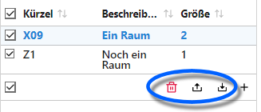
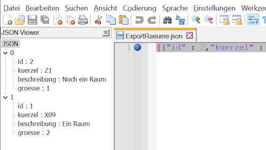

# Räume

## Räume anlegen und verwalten

Über diesen Katalog lassen sich *Räume* erfassen, die dann über den Stundenplan verplant werden können.


Erzeugen Sie über das **+** neue Räume, im Screenshot wird es durch den grünen Pfeil gezeigt.

In jedem Raum können ein **Kürzel** und eine relative **Größe** für einen Raum vergeben werden.

Weitere Informationen lassen sich in der **Beschreibung** hinterlegen.

## Export, Import und Löschen

Über die Auswahlliste steht ein **Import** zur verfügung, über den eine json-Datei mit Rauminformationen eingelesen werden kann.



Hat man Räume über die Checkboxen angewählt, können diese **exportiert** oder über das Mülleimer-Icon 🗑 gelöscht werden.

## Die json-Datei

Die json-Datei enthält die Rauminformationen in folgender Weise:

``` json
[{"id" : 2,"kuerzel" : "R2","beschreibung" : "Ein zweiter Raum","groesse" : 1},{"id" : 1,"kuerzel" : "R1","beschreibung" : "Ein erster Raum","groesse" : 2}]
```

Der komlette Datensatz ist mit eckigen Klammern **[]** eingefasst. Jeder Eintrag ist in geschweifte Klammern **{}** eingefasst, folgende Räume werden durch ein Komma **,** getrennt.

Innerhalb eines Eintrags finden sich Tags mit Daten. Nach einem Doppelpunkt **:** folgt der jeweilige Wert. Zahlen werden direkt geschrieben, Textfolgen in Anführungszeichen **""** eingefasst. Jeder Eintrag wird mit einem Komma getrennt.

Manche Editoren erlauben das besser lesbare Anzeigen von json-Files:



Hier wurde *Notepad++* mit dem Plugin *JSON Viewer* verwendet.