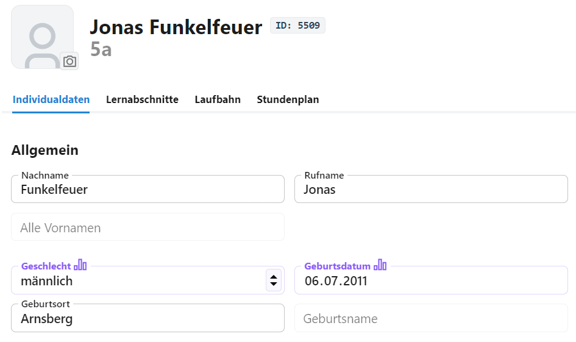
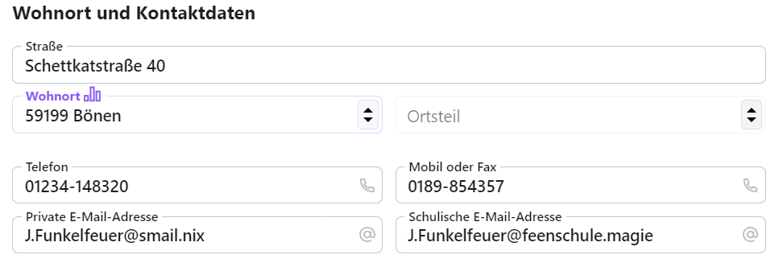
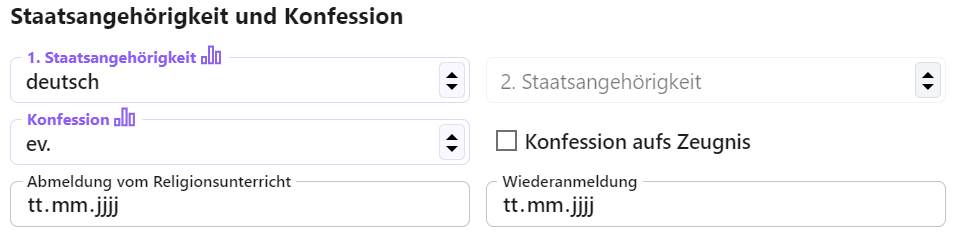

# Schüler

In der App **Schüler** werden die zahlreichen Daten zu den Schülern erfasst.

Im ersten Tab finden sich die persönlichen **Individualdaten**.

**Hinweis:** Beachten Sie unbedingt die *statistikrelevanten* Felder, sind diese korrekt ausgefüllt, werden Fehler bei der Statistik oder diversen Berechnungen zu Abschluss und Schulpflicht vermieden.

## Allgemein

Erfassen Sie **Namen** und **Rufname** der Schüler. Weitere Vornamen können im Feld **Alle Vornamen** aufgenommen werden.

Im Feld **Geschlecht** sind die Werte *männlich*, *weiblich*, *divers* oder *Ohne Angabe* auswählbar.

Zu den Geburtsdaten lassen sich **Geburtsdatum**, der **Geburtsort** und eineventuell abweichender **Geburtsname** aufnehmen.

## Wohnort und Kontaktdaten

Über die Kontaktdaten werden eben diese Daten der Schüler erfasst. 

Nach der Einschulung kann hier auch die **schulische E-Mailadresse** zur Kommunikation hinterlegt werden.

## Staatsangehörigkeit und Konfession

Tragen Sie die **Staatsangehörigkeit** ein. Die deutsche Staatsangehörigkeit wird immer als **1. Staatsangehörigkeit** aufgenommen und diese ist auch die einzige der beiden, die *statistikrelevant* ist.

Beachten Sie beim Eintrag der **Konfession** auch die aktuellen Vorgaben zu dieser, die den Schlüsseltabellen beziehungsweise den Eintragungshilfen zur amtlichen Schulstatistik von IT.NRW zu entnehmen sind.

Die Konfessionen werden in ihrem Katalog statistikonform aufgenommen.

Haken Sie über **Konfessione aufs Zeugnis** an, ob die Konfession über die Zeugnisformulare ausgebene werden soll oder nicht.

Ist ein Schüler über die Konfession automatisch einem Religionunsunterricht zugeordnet oder diesen eben nicht, werden die **bnmeldungen vom Religionsunterricht** und **Wiederanmeldungen** über diese Datumsfelder erfasst.

Die Felder sind statstikrelevant, liegen aber keine Meldungen vor, sind auch Leereinsträge zulässig.

## Migrationshintergrund

## Statusdaten
