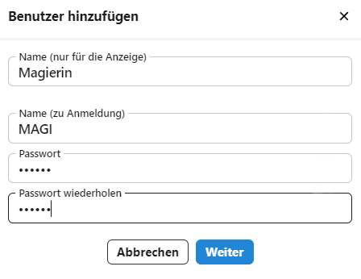

# Benutzerverwaltung

Im Bereich **Benutzer** werden die einzelnen Benutzer und ihre Berechtigungen eingerichtet.

Hierzu werden erst **Benutzergruppen** eingerichtet, die per Schalter für einzelne Benutzer aktiviert werden können. Die Nutzer erhalten dann die für diese Benutzergruppe definierten Berechtigungen. 

## Benutzerverwaltung

)

Über die Auswahlliste erreichen Sie alle eingerichteten Benutzer, das Suchfeld grenzt Benutzer auf im Feld eingegebene Zeichenketten ein.

W#hlen Sie einen Benutzer an, um die **Berechtigungen** zu bearbeiten.

Per Checkbox angewhählte Benutzer können **gelöscht** werden.

Über das **+** werden neue Benutzer angelegt. Ein Klick öffnet das Fenster, in dem neue Benutzer erzeugt werden können:



Vergeben Sie einen **Anzeigenamen**, einen **Anmeldenamen** und ein erstes **Passwort**.

Beim Anmeldenamen empfiehlt es sich bei Lehrkräften, das *Kürzel* zu verwenden. Das Passwort muss unter Umständen Mindestanfordernungen in Bezug auf Lände, Groß- und Kleinschreibung und/oder Sonderzeichen genügen.

Das **X** oben rechts bricht die Eingabe ab.

Ein Klicka auf ```Weiter``` legt den Benutzer an.

## Rechte zuweisen


Einem Benutzer können mehrere Benutzergruppen zugewiesen werden, so dass dieser Benutzer Rechte von mehreren Gruppen erhält. Eine Beutzergruppe entspricht einer Rolle, der die Person an Ihrer Schule nachkommt.

Zusätzlich können einem Benutzer indivdiuell weitere Rechte gegeben werden. 

