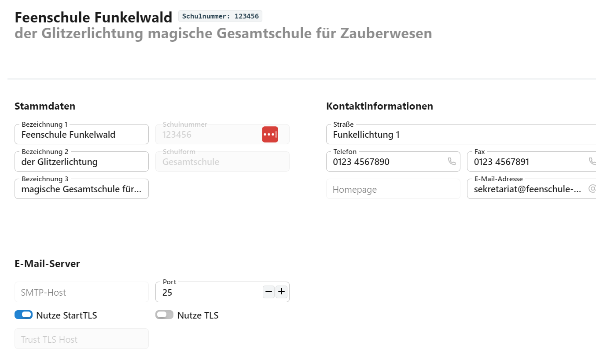
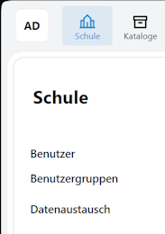

# Schule

In der Übersicht **Schule** werden allgemeine Angaben zur Schule aufgenommen.

Oben werden Name und Schulnummer angezeigt, darunter lassen sich die **Stammdaten** mit den drei Bezeichungen zur Schule wie auch die Adresse und andere Kontaktdaten angeben.

Über die linke Auswahlspalte sind von hier die Verwaltung für die **Benutzer** und ihre **Benutzergruppen** zu erreichen, mit denen die Recht der einzelnen Benutzer gesteirt werden.

Weiterhin ist hier der Bereich **Datenaustausch** zu öffnen, über den Exporte und Importe von und an Software oder Dateien ermöglicht wird.

**TODO**

## Email

Darunter werden die Daten eingegeben, mit denen sich ein SMTP-Host erreichen lässt, um E-Mails aus dem SVWS-Client versenden zu können.

